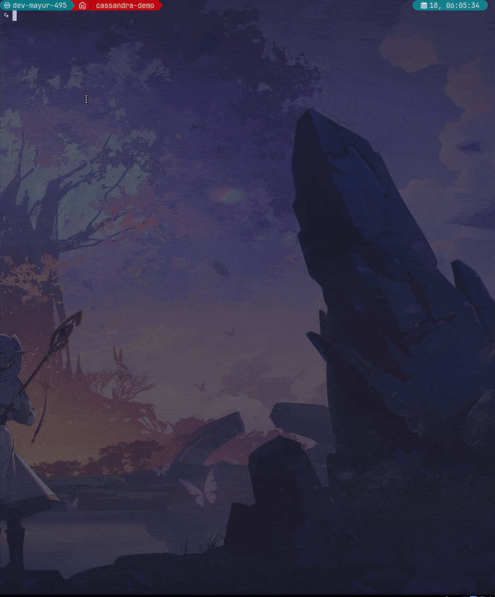

# SSH Portfolio TUI

An interactive terminal portfolio accessible over SSH, built with Go and the [Charmbracelet](https://charm.sh/) stack.

```
ssh portfolio.mayurathavale.com
```



## Features

- **Interactive TUI** — 6 tabs (About, Experience, Projects, Skills, Contact, Stats) with keyboard navigation
- **ASCII art header** — Custom block-font name renderer on the About tab
- **Visitor analytics** — SQLite-backed tracking with live connection count, visit history, and IP privacy masking
- **Content from YAML** — Portfolio data loaded from `content/portfolio.yaml`, embedded at compile time
- **Env-based config** — `SSH_PORT`, `HOST_KEY_DIR`, `DB_PATH` for flexible deployment
- **Production-ready** — Dockerfile, systemd service, Terraform config, CI/CD with GHCR

## Quick Start

```bash
# Clone and run locally
git clone https://github.com/mayurathavale18/ssh-portfolio-tui.git
cd ssh-portfolio-tui

# Run on port 2222 (no sudo needed)
SSH_PORT=2222 make run

# Connect from another terminal
ssh -t localhost -p 2222
```

## Keyboard Shortcuts

| Key | Action |
|---|---|
| `tab` / `→` / `l` | Next tab |
| `shift+tab` / `←` / `h` | Previous tab |
| `1-6` | Jump to tab |
| `j` / `↓` | Scroll down |
| `k` / `↑` | Scroll up |
| `q` / `ctrl+c` | Quit |

## Architecture

```
cmd/server/main.go           Entrypoint — config, analytics, server init
content/
  portfolio.yaml              Portfolio data (embedded at compile time)
  types.go, embed.go          Content types and YAML loader
internal/
  config/                     Env-based configuration
  server/                     SSH server setup with Wish middleware
  analytics/
    store.go                  SQLite persistence (WAL mode, auto-migration)
    tracker.go                Thread-safe active visitor counter
  ui/
    model.go                  Root Bubble Tea model with tab navigation
    keys.go                   Keybindings
    theme/styles.go           Centralized color palette and lipgloss styles
    components/
      header.go               Tab bar + ASCII art header
      footer.go               Keybind hints + live visitor count
      ascii.go                Custom figlet-style block font renderer
    tabs/                     About, Experience, Projects, Skills, Contact, Stats
```

## Deployment

### One-command EC2 Setup

```bash
# 1. Build the binary
make build-linux-amd64

# 2. Upload to your server
scp -O -P <admin-port> build/ssh-portfolio-linux-amd64 user@your-server:/tmp/

# 3. SSH in and run the setup script
ssh -p <admin-port> user@your-server
sudo bash deploy/setup.sh /tmp/ssh-portfolio-linux-amd64
```

The setup script automatically:
- Moves system SSH to port 2222 (with safety confirmation)
- Creates a `portfolio` service user
- Generates SSH host keys
- Installs and enables a systemd service on port 22
- Prints the `ssh <ip>` command when done

### Docker

```bash
# Build and run
make docker-build
make docker-run

# Or with docker compose (maps to port 2222)
make docker-up
```

### Terraform (fresh EC2)

```bash
cd deploy/terraform
export AWS_PROFILE=your-profile
terraform init
terraform apply -var="key_name=your-key-pair"
# Output: ssh <elastic-ip>
```

## Development

```bash
make build          # Build binary
make test           # Run all tests
make lint           # Run go vet
make docker-build   # Build Docker image
```

## Tech Stack

- **Go** — Bubble Tea, Lipgloss, Wish (Charmbracelet ecosystem)
- **SQLite** — Pure Go driver (modernc.org/sqlite), no CGO
- **Docker** — Multi-stage build, Alpine runtime
- **Terraform** — AWS EC2, Elastic IP, security groups
- **GitHub Actions** — CI/CD with binary releases + GHCR Docker images
